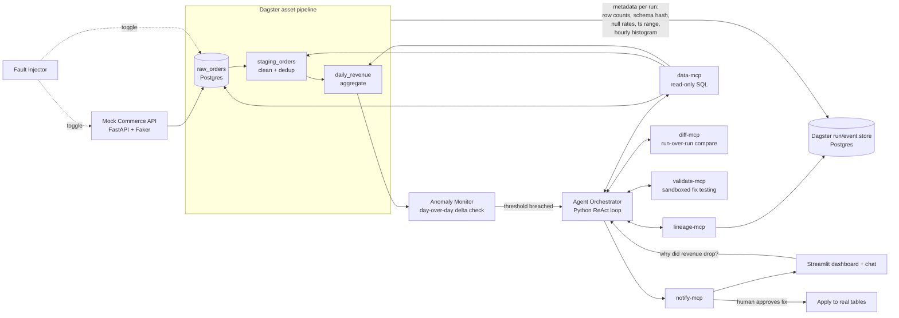

# PipelineDoctor — AI Data Pipeline Debugger

**Project Plan & Technical Documentation**

**Type:** Agentic root-cause analysis over a data pipeline
**Stack:** Python end-to-end (no Go this time — orchestration, agent, tools, and dashboard are all Python)
**Positioning:** Forward Deployed AI Engineer portfolio project — demonstrates large-scale data analytics judgment, not just "an agent that answers questions."

---

## 1. Problem Statement

*"Yesterday's revenue dropped 40%. Did sales actually fall, or did our pipeline break?"*

This is one of the most common — and highest-stakes — questions a data team gets asked, and answering it well requires distinguishing between several very different failure modes: a silently skipped data load, duplicated records inflating or deflating a metric, a schema change upstream breaking a transform, a timezone bug shifting numbers across a day boundary, or — the case everyone forgets to design for — **the number is just correct, and the business genuinely changed.**

**PipelineDoctor** ingests synthetic commerce data through a real ETL pipeline, tracks lineage and run metadata at every stage, and when a metric looks wrong, an agent investigates the pipeline's own history to find (or rule out) a technical cause — then proposes a fix that gets validated in a sandbox before anything touches real data.

Unlike a generic RAG demo, this forces real engineering decisions about trust, validation, and blast radius — the actual substance of forward-deployed work. Target scale: **~50k synthetic orders/day over ~8 weeks of history (≈2.8M raw rows)** — enough that every diagnosis must run on metadata and targeted queries, not by eyeballing the data.

---

## 2. Goals & Success Criteria

| Goal | Success Metric |
|---|---|
| Correctly classify *why* a metric looks wrong | ≥80% root-cause classification accuracy across 5 scenario classes (incl. "not a bug") |
| Don't cry wolf | ≤10% false-positive rate on the "real business change" control case — reported separately and prominently; this is the metric that matters most |
| Propose fixes that are actually safe | 100% of applied fixes pass a sandboxed before/after validation — nothing touches real tables unvalidated |
| Be fast enough to be useful | Median time-to-diagnosis under 2 minutes from trigger to posted hypothesis, reported per scenario |
| Be demoable end-to-end | Inject a fault → dashboard shows the bad number → ask the agent "why" → get a cited, evidence-backed answer |

---

## 3. System Architecture



**Component summary:**

| Component | Responsibility |
|---|---|
| Mock Commerce API | FastAPI service generating synthetic orders/customers/refunds via Faker — your controllable "source system" |
| Fault Injector | Toggleable module that induces the 5 bug classes below, into either the API or the raw ingestion step |
| Dagster asset pipeline | `raw_orders → staging_orders → daily_revenue`, each asset attaching structured metadata on every materialization |
| Dagster run/event store | Postgres-backed history Dagster already gives you for free — this *is* your lineage backbone, no need to hand-roll one |
| Anomaly Monitor | Simple day-over-day delta check on `daily_revenue`; crosses a threshold → triggers the agent |
| Agent Orchestrator | Python ReAct loop; gathers evidence, forms a hypothesis, decides whether to propose a fix |
| MCP tool servers | Each wraps one investigative capability (lineage, raw SQL, diffing, sandboxed validation, notification) |
| Streamlit dashboard | Shows the (possibly broken) revenue chart *and* doubles as the chat interface to the agent — this is your "client-facing" surface |

---

## 4. Tech Stack (Python-first)

- **API / data generation:** FastAPI + Faker
- **Orchestration & lineage:** [Dagster](https://dagster.io) — asset-based, Python-native, and provides real run history and per-materialization metadata out of the box instead of hand-rolling a lineage table. Using a real, known DE tool here is a deliberate build-vs-buy call.
- **Storage:** Postgres — separate schemas for `raw`, `staging`, `analytics`, plus a `sandbox` schema used only by `validate-mcp`
- **Agent framework:** Anthropic API tool use in a plain-Python ReAct loop — no agent framework dependency
- **Tool protocol:** MCP — one small server per investigative capability (5 total)
- **Dashboard / chat UI:** Streamlit — fast to build, keeps the whole stack in Python, and looks good in a demo recording
- **Fault injector:** plain Python, no extra dependency — a small module with 5 toggle functions
- **Eval harness:** plain Python + pytest-style scenario runner

Nothing here requires Go or any JVM tooling — the only non-Python pieces are Postgres itself and, optionally, Docker Compose to wire it all together.

---

## 5. Fault Injection Classes (your labeled ground truth)

| # | Class | What actually happens | Signature the agent should learn to spot |
|---|---|---|---|
| 1 | Missing batch | A day's orders are silently never ingested | Gap in `raw_orders` partition dates; `staging`/`daily_revenue` show a real drop that traces to zero upstream rows for that date |
| 2 | Duplicate records | Extract step re-ingests the same batch twice | Row count for one date roughly doubles in `raw_orders` while `COUNT(DISTINCT order_id)` for that date stays normal — directly checkable via `data-mcp`, no source-system access needed |
| 3 | Schema drift | Upstream silently renames `order_total` → `total_amount` | Schema hash on `raw_orders` changes between runs; `staging_orders` shows a spike in null/failed-parse rows right after |
| 4 | Timezone bug | Aggregation buckets by UTC when it should bucket by local time | Total row count and total sum are *unchanged*, but the day-over-day *shape* shifts — a purely distributional anomaly surfaced by `diff-mcp`'s hourly-histogram comparison, invisible to any volume check |
| 5 | **Real business change (control)** | No injected bug — demand genuinely dropped | No lineage anomalies anywhere: stable schema hash, expected row counts, no gaps, no null spikes. The agent should conclude "pipeline is healthy" |

Class 5 is the most important one to build and test well — an agent that finds *something* to blame every time it's asked is worse than useless in a real ops setting.

---

## 6. Agent Design

### 6.1 Reasoning loop

1. **Trigger** — either the anomaly monitor fires, or a user asks a question in the Streamlit chat
2. **Scope the investigation** — identify the affected asset (`daily_revenue`) and walk its upstream dependency graph via `lineage-mcp`
3. **Pull run metadata** for the current and previous N runs of each upstream asset: row counts, schema hash, null rates, materialized date ranges, hourly order-count histogram
4. **Diff** current vs. last-known-good run via `diff-mcp` — flag any anomaly (count delta, hash change, date gap, distributional shift). *Last-known-good* is defined as the most recent materialization that completed successfully **and** predates the first run inside the anomaly window flagged by the monitor
5. **Match against known fault signatures** (table in §5) to form a hypothesis with a confidence score, citing exactly which metadata anomalies support it
6. **If no anomalies are found anywhere in the lineage** → explicitly conclude "no pipeline defect found; likely a real business change" rather than staying silent or forcing a technical explanation
7. **If a safe fix template exists** for the diagnosed class → run it in the `sandbox` schema via `validate-mcp`, diff sandbox output against expected reconciliation, and only then present it as "ready to apply, pending your approval." One template per fixable class:
   - **Class 1 (missing batch):** replay the missing date's batch from the source API into sandbox, re-aggregate
   - **Class 2 (duplicates):** dedupe by `(order_id, ingested_at)`, re-aggregate
   - **Class 3 (schema drift):** column remap in staging (`total_amount` → `order_total` alias), re-parse the affected rows, re-aggregate
   - **Class 4 (timezone):** this is a *code* fix, not a data fix — `validate-mcp` re-runs the aggregation in sandbox with corrected local-time bucketing and diffs the result; what gets proposed for approval is the code patch plus the sandbox-recomputed table as evidence
8. **Report** via `notify-mcp`: hypothesis, confidence, cited evidence, and (if applicable) the proposed fix with its sandbox diff — posted to the Streamlit chat and optionally Slack

### 6.2 MCP tool servers

| Tool | Wraps | Key calls |
|---|---|---|
| `lineage-mcp` | Dagster's instance/run API | `get_asset_history(asset, n_runs)`, `get_dependencies(asset)` |
| `data-mcp` | Read-only Postgres role | `query(sql)` — SELECT-only, enforced at the DB role level, not just prompt instruction |
| `diff-mcp` | Comparison logic over two run metadata snapshots | `diff_runs(asset, run_id_a, run_id_b)` → row count delta, schema hash change, null-rate delta, date coverage gap, hourly-histogram distributional shift (required to catch class 4, which is invisible to volume checks) |
| `validate-mcp` | Sandbox schema + fix templates | `run_fix(fix_type, params)` → executes in `sandbox`, returns before/after diff against `analytics` |
| `notify-mcp` | Streamlit session state + optional Slack webhook | `post_finding(summary, evidence, proposed_fix=None)` |

### 6.3 Guardrails

- `data-mcp` connects with a Postgres role that has **SELECT only** — not a prompt-level restriction, an actual database permission
- No tool can write to `raw`, `staging`, or `analytics` schemas directly — only `validate-mcp` can write, and only to `sandbox`
- Applying a validated fix to real tables always requires an explicit human click in the Streamlit UI — the agent proposes, it never applies
- Every hypothesis must cite at least one concrete piece of evidence (a specific metadata field and value) — no unsupported conclusions allowed by the prompt contract

---

## 7. Build Roadmap

| Phase | Scope | Deliverable |
|---|---|---|
| 0 — Environment | Docker Compose: Postgres, Dagster webserver | `docker compose up` brings up storage + Dagster UI |
| 1 — Data generation | FastAPI mock commerce API + Faker seed data: ~50k orders/day over ~8 weeks of "good" history (≈2.8M raw rows) | Realistic baseline dataset to break later |
| 2 — Pipeline | Dagster assets `raw_orders → staging_orders → daily_revenue`, each attaching metadata on materialization (row count, schema hash, null rates, ts range, hourly histogram) | Dagster UI shows a real lineage graph with run history |
| 3 — Fault injector | Implement all 5 classes from §5, toggleable per pipeline run | Can reliably reproduce each bug class on demand |
| 4 — MCP tool servers | Build all 5 tools against the real Postgres + Dagster instance | Each tool independently callable/testable |
| 5 — Agent orchestrator | ReAct loop + anomaly monitor + Streamlit chat | End-to-end: inject fault → ask "why" → get cited hypothesis |
| 6 — Evaluation harness | Run all 5 scenario classes N times each, score per §8 | Accuracy table, including the false-positive metric on class 5 |
| 7 — Documentation & demo | README, architecture doc, recorded walkthrough, short write-up | Portfolio-ready repo + interview talking points |

Rough pacing: phases 0–2 in a weekend, 3–5 are the bulk (1–2 weeks), 6–7 are what make this defensible in an interview rather than just a demo — don't skip them, especially the class-5 false-positive number.

---

## 8. Evaluation Plan

1. For each of the 5 scenario classes, define the **ground-truth label** and run the injector N times (e.g. N=10) against a fresh seeded dataset each time
2. Score:
   - **Root-cause classification accuracy** — predicted class vs. true class (5-way, including "no defect")
   - **False-positive rate on class 5** — reported separately and prominently, since this is the failure mode that erodes trust fastest in a real deployment
   - **Fix validity** — for classes 1–4, does the sandboxed fix actually restore the correct `daily_revenue` value without corrupting adjacent dates?
   - **Time-to-diagnosis** — wall clock from trigger to posted hypothesis
   - **Evidence quality** (manual spot-check) — does the cited evidence actually support the conclusion, or is it a plausible-sounding hallucination?
3. Publish the results table in `docs/eval-report.md` — this table is the headline artifact of the project: it turns a demo into a measured system

---

## 9. Documentation to Produce (repo structure)

```
pipelinedoctor/
├── README.md            # what it is, architecture diagram, quickstart
├── ARCHITECTURE.md      # the detail in §3–6, repo-specific
├── docs/
│   ├── mcp-tools.md     # tool schemas, example calls/responses
│   ├── fault-classes.md # §5 table, expanded with injection code pointers
│   └── eval-report.md   # §8 results, updated as the agent improves
├── services/
│   ├── mock_api/        # FastAPI + Faker
│   ├── pipeline/        # Dagster assets
│   ├── fault_injector/
│   ├── mcp_servers/     # one subfolder per tool
│   ├── agent/           # orchestrator, ReAct loop
│   └── dashboard/       # Streamlit app
├── eval/
│   └── scenarios/       # scenario definitions + expected outcomes
└── docker-compose.yml
```

---

## 10. How to Talk About This in an Interview

- **"Large-scale data analytics" isn't just SQL — it's knowing when *not* to trust a number.** The class-5 control case is the detail to lead with: you deliberately built and measured a "don't cry wolf" scenario, which is the difference between a demo and a system someone would actually deploy.
- **You reused a real orchestration tool (Dagster) instead of reinventing lineage tracking** — shows judgment about when to build vs. use existing infrastructure, which is exactly the call an FDE has to make constantly on client engagements.
- **The sandbox-then-approve pattern for fixes** is a deliberate trust boundary — the agent proposes and validates, a human applies. Presenting it as a design principle (rather than a UI detail) reads as a genuine point of view about deploying agents safely.
- **Evidence-citation requirement in the prompt contract** is a small detail worth mentioning — it's a concrete technique for reducing hallucinated root causes, which is a real, current problem in production agent systems.

---

## Next Steps

1. **Phase 0–1:** scaffold the repo per §9, stand up Docker Compose (Postgres + Dagster), and build the FastAPI mock API with ~8 weeks of seeded history
2. **Phase 2:** implement the three Dagster assets with per-materialization metadata (row count, schema hash, null rates, timestamp range, hourly histogram)
3. **Phase 3:** implement the fault injector with one toggle per class in §5, and verify each produces its documented signature before building any agent code
